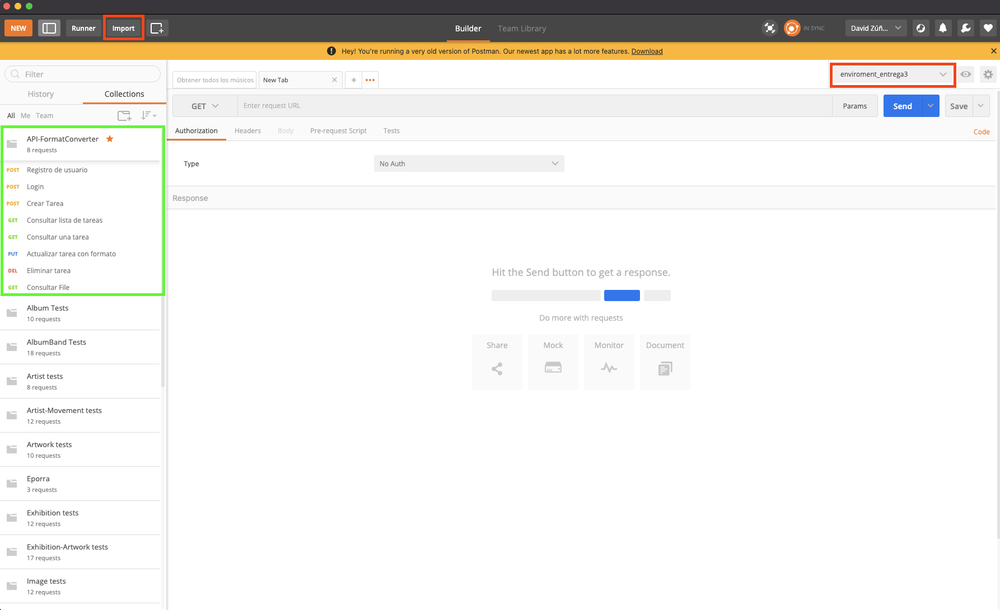
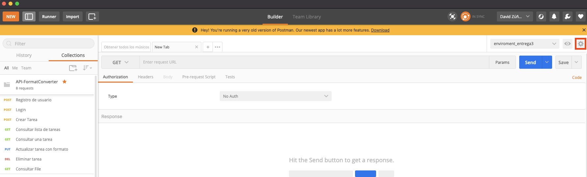
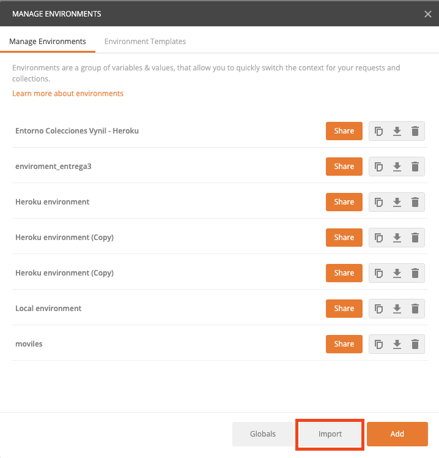

# Probar servicios de la API

## Descripción

A continuación de índica la manera en que puede probar manualmente el API REST de la aplicación:

## Descarga de Collection y Enviroment

Al clonar el repositorio, usted puede encontrar los archivos **collection** y **enviroment** de Postman en la ruta: `/documentation` allí encontrará el archivo llamado:

### API-FormatConverter.postman_collection.json

Puede importar el archivo directamente en Postman de la siguiente manera:
 1. Buscar la opcion importar en Postman
 2. Al accionar el boton importar, debe seleccionar el archivo llamado `/documentation/API-FormatConverter.postman_collection.json`
 3. Despues de importarlo le debe aparecel la collection en el sidebar de la herramienta como se muestra en la imagen.

    

### enviroment_entrega3.postman_environment.json

Puede importar el archivo directamente en Postman de la siguiente manera:
 1. Buscar la opcion de Enviroments en postman
 2. Al accionar el boton configurar, como muesta la imagen:
    
 3. Seleccionar la opcion Manage Enviroments
 4. Importar y seleccionar el archivo ubicado en: `enviroment_entrega3.postman_environment.json`
    
 5. Seleccionar enviroment llamado `enviroment_entrega3`

 ### Ahora puede ejecutar los diferentes endpoints del **API REST** 